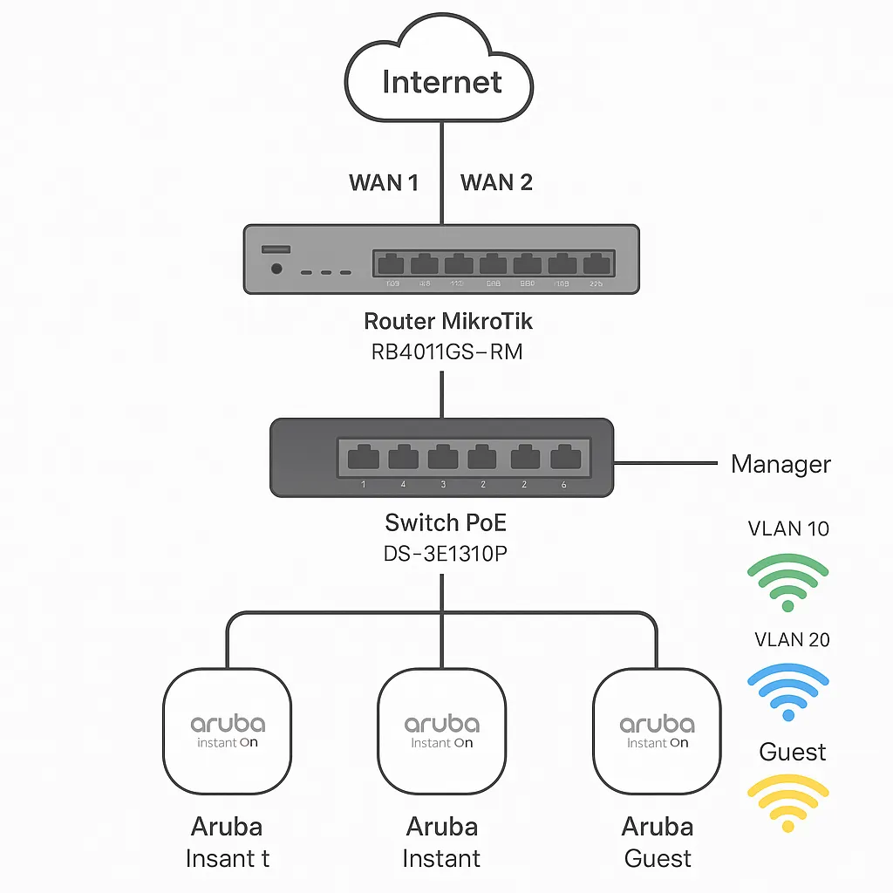

# MIKROTIK - CẤU HÌNH RB4011 CHUẨN
> 10 ETH + PCC + VLAN



* ROUTER MIKROTIK: CẮM LINE VNPT PORT 1, VIETTEL PORT 2 (GIAO THỨC PPPOE)
* CẮM PORT 3-10 TRUYỀN XUỐNG UP LINK SWITCH POE HỖ TRỢ VLAN
* CẮM AP VÀO PORT SWITCH VÀ CẤU HÌNH AP
	* SSID MANAGER (IP NỘI BỘ - KHÔNG TAG VLAN)
	* SSID NHÂN VIÊN (TAG VLAN ID: 10)
	* SSID KHÁCH (TAG VLAN ID: 20)
* DÃI IP NỘI BỘ CHẠY CAMERA + CẤU HÌNH
* DÃI IP VLAN 10 NHÂN VIÊN ODER QUẦY, MÁY POS
* DÃI IP VLAN 20 KHÁCH SỬ DỤNG CÓ THỂ ĐỂ DHCP CAO ĐỂ NHIỀU USER CÓ THỂ SỬ DỤNG. VÍ DỤ: X.X.X.X/23
* CẤU HÌNH THÔNG QUA WINBOX TERMINAL

## ĐẶT MÚI GIỜ VÀ ĐỒNG BỘ THỜI GIAN

```bash
/system clock set time-zone-name=Asia/Ho_Chi_Minh
/system ntp client set enabled=yes mode=unicast primary-ntp=vn.pool.ntp.org secondary-ntp=1.pool.ntp.org
```

## TẠO BRIDGE CHÍNH CÓ VLAN FILTERING

```bash
/interface bridge add name=bridge-lan vlan-filtering=yes
```

## GẮN CÁC PORT VÀO BRIDGE VỚI PVID PHÙ HỢP

```bash
/interface bridge port
add bridge=bridge-lan interface=ether3 pvid=1
add bridge=bridge-lan interface=ether4 pvid=10
add bridge=bridge-lan interface=ether5 pvid=20
add bridge=bridge-lan interface=ether6 pvid=1
add bridge=bridge-lan interface=ether7 pvid=1
add bridge=bridge-lan interface=ether8 pvid=1
add bridge=bridge-lan interface=ether9 pvid=1
add bridge=bridge-lan interface=ether10 pvid=1
```

## TẠO VLAN

```bash
/interface vlan
add name=vlan10 vlan-id=10 interface=bridge-lan
add name=vlan20 vlan-id=20 interface=bridge-lan
add name=vlan35-viettel vlan-id=35 interface=ether2
```

## CẤU HÌNH VLAN TRÊN BRIDGE

```bash
/interface bridge vlan
add bridge=bridge-lan vlan-ids=1 untagged=ether3,ether6,ether7,ether8,ether9,ether10 tagged=bridge-lan
add bridge=bridge-lan vlan-ids=10 untagged=ether4 tagged=bridge-lan
add bridge=bridge-lan vlan-ids=20 untagged=ether5 tagged=bridge-lan
```

## PPPOE CLIENT

```bash
/interface pppoe-client
add name=pppoe-vnpt interface=ether1 user="VNPT_USERNAME" password="VNPT_PASSWORD" use-peer-dns=no add-default-route=no disabled=no
add name=pppoe-viettel interface=vlan35-viettel user="VIETTEL_USERNAME" password="VIETTEL_PASSWORD" use-peer-dns=no add-default-route=no disabled=no
```

## ĐẶT ĐỊA CHỈ IP

```bash
/ip address
add address=192.168.1.1/24 interface=bridge-lan
add address=192.168.10.1/24 interface=vlan10
add address=192.168.20.1/23 interface=vlan20
```

## DNS SERVER

```bash
/ip dns set servers=1.1.1.1,8.8.8.8 allow-remote-requests=yes
```

## IP POOLS

```bash
/ip pool
add name=pool-lan ranges=192.168.1.100-192.168.1.200
add name=pool-vlan10 ranges=192.168.10.100-192.168.10.200
add name=pool-vlan20 ranges=192.168.20.100-192.168.21.200
```

## DHCP SERVER

```bash
/ip dhcp-server
add name=dhcp-lan interface=bridge-lan address-pool=pool-lan disabled=no
add name=dhcp-vlan10 interface=vlan10 address-pool=pool-vlan10 disabled=no
add name=dhcp-vlan20 interface=vlan20 address-pool=pool-vlan20 lease-time=1h disabled=no
```

## DHCP NETWORK

```bash
/ip dhcp-server network
add address=192.168.1.0/24 gateway=192.168.1.1
add address=192.168.10.0/24 gateway=192.168.10.1
add address=192.168.20.0/23 gateway=192.168.20.1
```

## PCC LOAD BALANCING

```bash
/ip firewall mangle
add chain=prerouting src-address=192.168.1.250 action=mark-routing new-routing-mark=to-vnpt passthrough=yes
add chain=prerouting in-interface=bridge-lan connection-mark=no-mark dst-address-type=!local per-connection-classifier=both-addresses:2/0 action=mark-connection new-connection-mark=conn-vnpt passthrough=yes
add chain=prerouting in-interface=bridge-lan connection-mark=no-mark dst-address-type=!local per-connection-classifier=both-addresses:2/1 action=mark-connection new-connection-mark=conn-viettel passthrough=yes
add chain=prerouting connection-mark=conn-vnpt in-interface=bridge-lan action=mark-routing new-routing-mark=to-vnpt passthrough=yes
add chain=prerouting connection-mark=conn-viettel in-interface=bridge-lan action=mark-routing new-routing-mark=to-viettel passthrough=yes
```

## NAT

```bash
/ip firewall nat
add chain=srcnat out-interface=pppoe-vnpt action=masquerade
add chain=srcnat out-interface=pppoe-viettel action=masquerade
```

## ROUTES

```bash
/ip route
add dst-address=0.0.0.0/0 gateway=pppoe-vnpt routing-mark=to-vnpt check-gateway=ping
add dst-address=0.0.0.0/0 gateway=pppoe-viettel routing-mark=to-viettel check-gateway=ping
add dst-address=0.0.0.0/0 gateway=pppoe-vnpt,pppoe-viettel
```

## FIREWALL FILTER

```bash
/ip firewall filter
add chain=input in-interface=bridge-lan action=accept comment="Allow LAN access to router"
add chain=input connection-state=established,related action=accept comment="Allow established/related"
add chain=input protocol=icmp in-interface=pppoe-vnpt action=drop comment="Drop ICMP VNPT"
add chain=input protocol=icmp in-interface=pppoe-viettel action=drop comment="Drop ICMP Viettel"
add chain=input in-interface=pppoe-vnpt action=drop comment="Drop WAN access VNPT"
add chain=input in-interface=pppoe-viettel action=drop comment="Drop WAN access Viettel"
add chain=forward dst-port=80,443 protocol=tcp in-interface=pppoe-vnpt action=accept comment="Allow DDNS/P2P VNPT"
add chain=forward dst-port=80,443 protocol=tcp in-interface=pppoe-viettel action=accept comment="Allow DDNS/P2P Viettel"
add chain=forward src-address=192.168.1.250 out-interface=pppoe-vnpt action=accept comment="Allow NVR P2P VNPT"
add chain=forward src-address=192.168.1.250 out-interface=pppoe-viettel action=accept comment="Allow NVR P2P Viettel"
add chain=forward out-interface=pppoe-vnpt dst-port=53 protocol=udp action=drop comment="Block DNS leak VNPT"
add chain=forward out-interface=pppoe-viettel dst-port=53 protocol=udp action=drop comment="Block DNS leak Viettel"
add chain=forward protocol=udp dst-port=67-68 in-interface=vlan10 src-address=!192.168.10.1 action=drop comment="Chặn DHCP lạ VLAN10"
add chain=forward protocol=udp dst-port=67-68 in-interface=vlan20 src-address=!192.168.20.1 action=drop comment="Chặn DHCP lạ VLAN20"
add chain=forward protocol=udp dst-port=67-68 in-interface=bridge-lan src-address=!192.168.1.1 action=drop comment="Chặn DHCP lạ LAN"
add chain=forward src-address=192.168.10.0/24 dst-address=192.168.1.0/24 action=drop comment="Block VLAN10 to LAN"
add chain=forward src-address=192.168.20.0/23 dst-address=192.168.1.0/24 action=drop comment="Block VLAN20 to LAN"
add chain=forward src-address=192.168.20.0/23 dst-address=192.168.10.0/24 action=drop comment="Block VLAN20 to VLAN10"
add chain=forward action=drop connection-mark=no-mark comment="Drop unmatched routing traffic"
```

## TẮT MAC SERVER TỪ WAN

```bash
/tool mac-server set allowed-interface-list=none
/tool mac-server mac-winbox set allowed-interface-list=none
```

## GIỚI HẠN TRUY CẬP WINBOX

```bash
/ip service set winbox address=192.168.1.0/24
```
